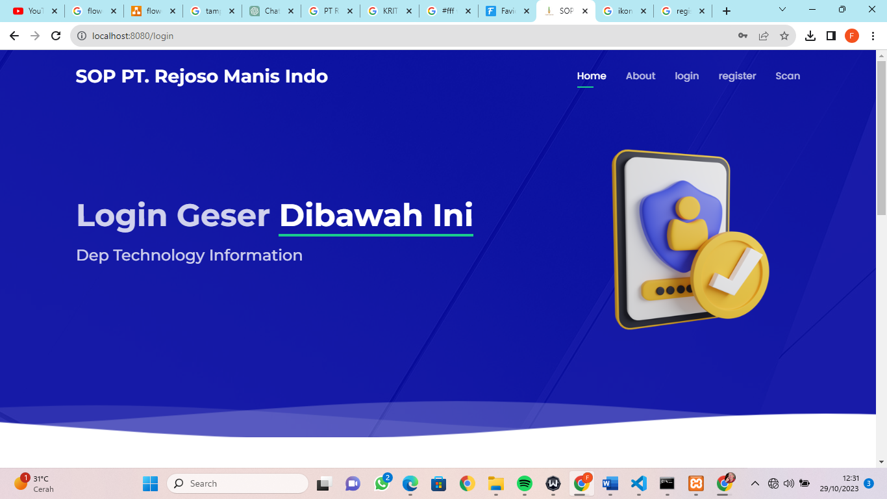
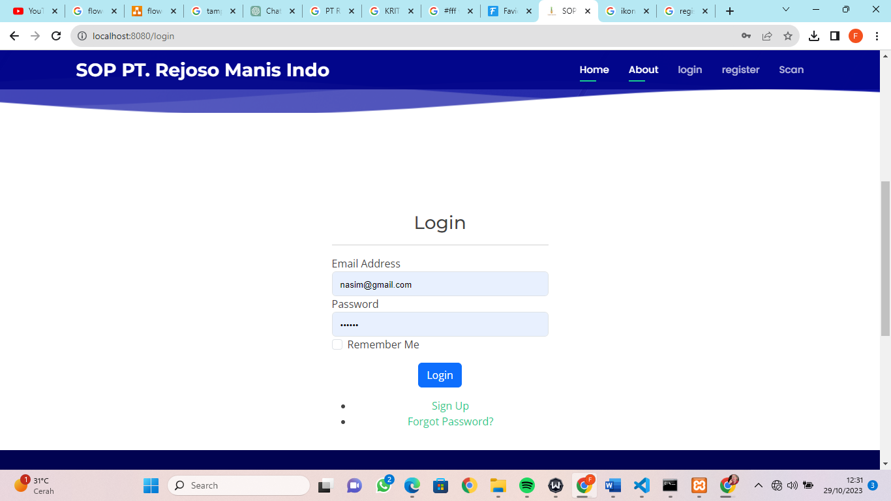
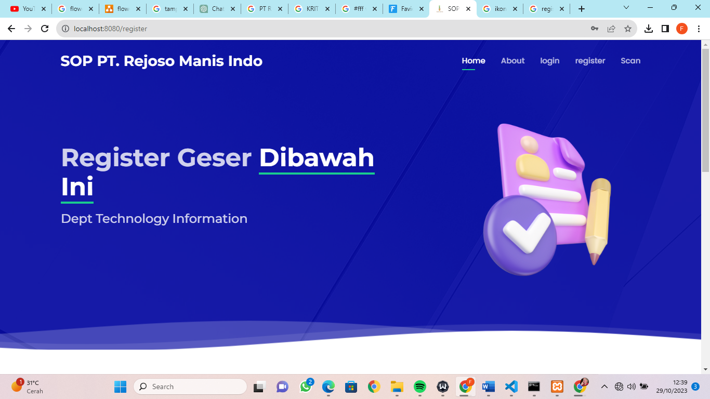
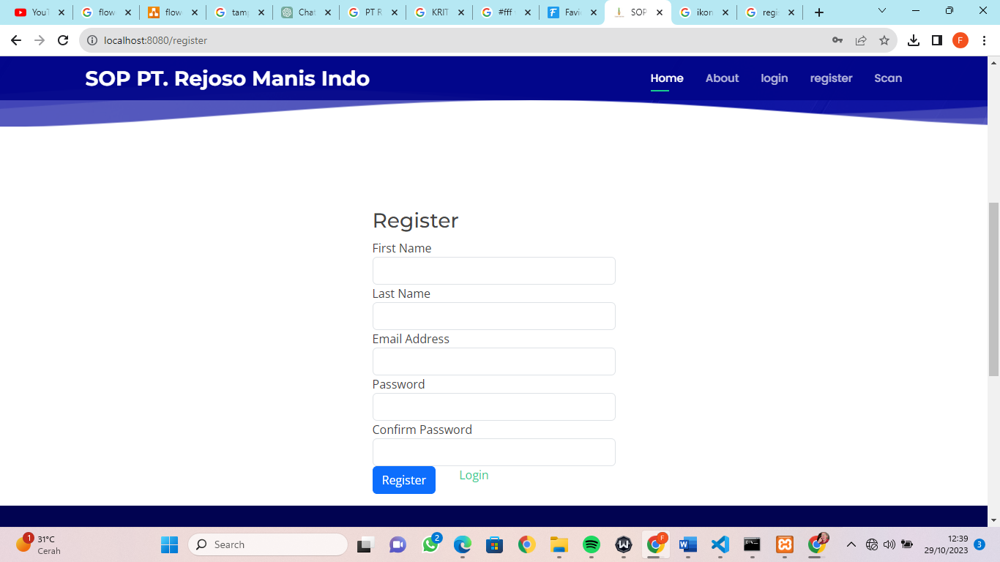
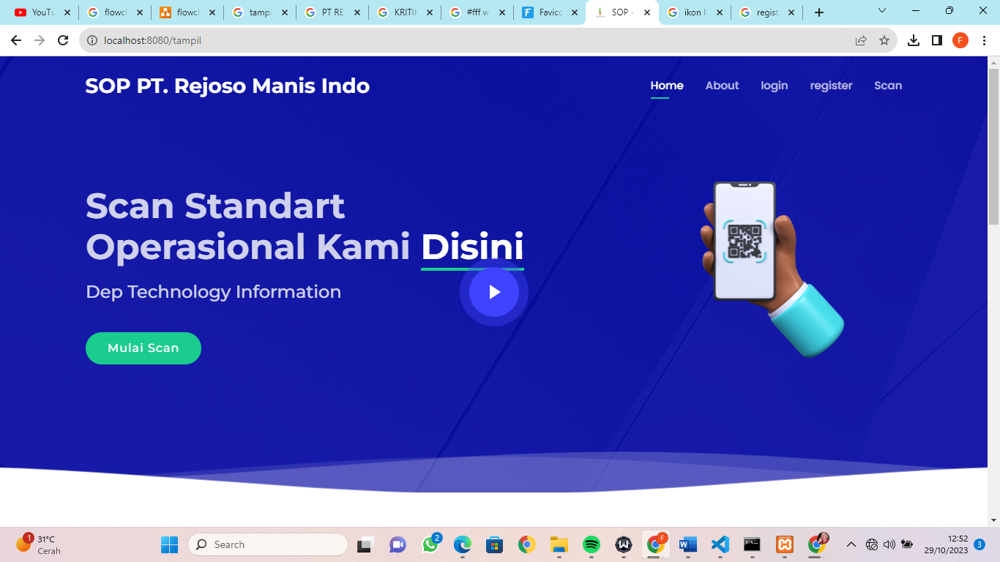
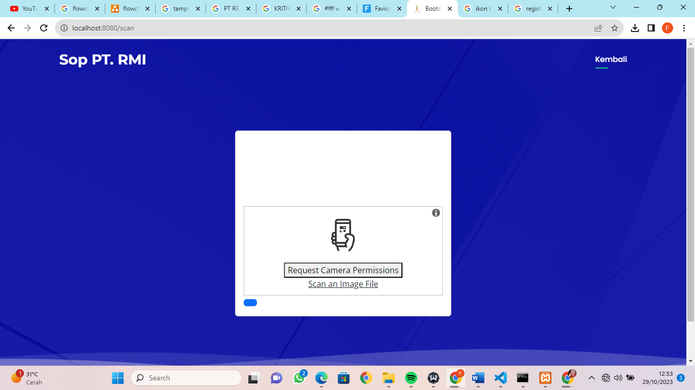
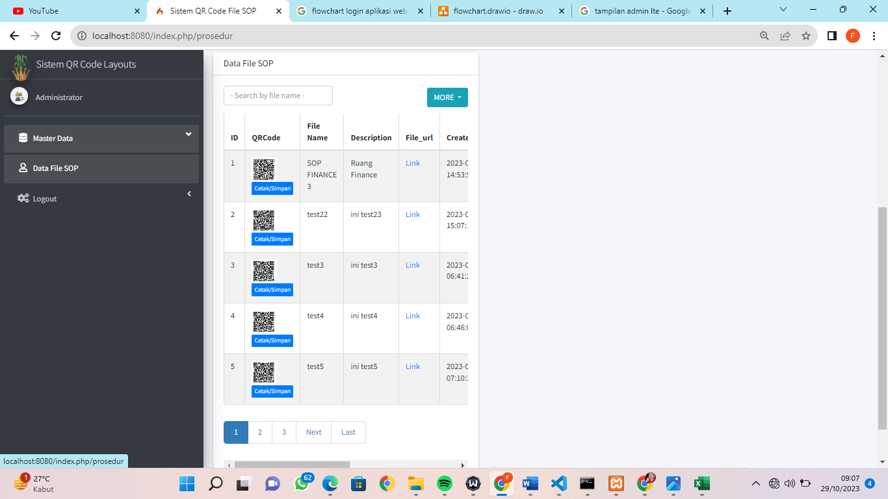

# 📌 Sistem SOP QR Generator

Sebuah aplikasi berbasis web untuk mengelola **SOP (Standard Operating Procedure)** dengan **QR Code Generator** dan **QR Code Scanner**.  
Sistem ini memudahkan **tamu/visitor** untuk mengetahui SOP suatu ruangan dengan cara **scan QR Code** yang sudah ditempelkan.

---

## ✨ Fitur Utama
- 📄 **Manajemen Data SOP**  
  Tambah, edit, hapus, dan simpan file SOP.
- 🔗 **QR Code Generator**  
  Setiap SOP otomatis memiliki QR Code unik.
- 📱 **QR Code Scanner**  
  User dapat langsung scan QR via kamera perangkat.
- 👨‍💻 **Autentikasi User**  
  Login & logout untuk admin pengelola data.
- 🎨 **UI Modern**  
  Menggunakan **Bootstrap 5** & **AdminLTE**.

---

## 🛠️ Teknologi
- [CodeIgniter 4](https://codeigniter.com/) (Framework PHP)
- [Bootstrap 5](https://getbootstrap.com/) (Frontend)
- [AdminLTE](https://adminlte.io/) (Template Admin)
- JavaScript, HTML, CSS, PHP
- MySQL / MariaDB

---

## 🚀 Instalasi

### 1. Clone Repository
```bash
git clone https://github.com/pankyprtm/sistem-sop-qr-generator.git
cd sistem-sop-qr-generator

Install Dependencies
composer install

3. Konfigurasi

Copy file .env.example menjadi .env

Atur database di .env:

database.default.hostname = localhost
database.default.database = sop_qr
database.default.username = root
database.default.password =
database.default.DBDriver = MySQLi

4. Migrasi Database
php spark migrate

5. Jalankan Aplikasi
php spark serve


Akses via browser: http://localhost:8080

📷 Preview

# Sistem SOP dengan QR Generator

Aplikasi berbasis **CodeIgniter 4**, **Bootstrap 5**, dan **AdminLTE** yang digunakan untuk mengelola SOP (Standard Operating Procedure) setiap ruangan/departemen.  
Sistem ini memungkinkan pengunjung/tamu untuk melakukan **scan QR Code** agar dapat langsung melihat SOP yang berlaku.

---

## ✨ Fitur
- 🔐 Manajemen SOP (CRUD: Create, Read, Update, Delete)  
- 📄 Upload file SOP (PDF/Doc) dengan URL  
- 📷 Generate QR Code untuk setiap SOP  
- 📱 Scanner QR bawaan untuk user  
- 📊 Dashboard modern dengan AdminLTE + Bootstrap 5  

---

## 🚀 Teknologi yang digunakan
- [CodeIgniter 4](https://codeigniter.com/)  
- [Bootstrap 5](https://getbootstrap.com/)  
- [AdminLTE](https://adminlte.io/)  
- [PHP](https://www.php.net/)  
- [JavaScript](https://developer.mozilla.org/en-US/docs/Web/JavaScript)  

---

## 📷 Preview

### 🔹 Dashboard & Data SOP
<p align="center">
  
  
</p>

### 🔹 Form Tambah Data
<p align="center">
  
  
</p>

### 🔹 QR Code Generator
<p align="center">
  
  
</p>

### 🔹 QR Scanner
<p align="center">
  
  
</p>

### 🔹 Lainnya
<p align="center">
  
  
</p>

---

## ⚡ Cara Install
1. Clone repository:
   ```bash
   git clone https://github.com/pankyprtm/sistem-sop-qr-generator.git
   cd sistem-sop-qr-generator


👨‍💻 Pengembang

Dibuat dan dikembangkan oleh Panky Yoga Pratama @
.

📜 Lisensi

MIT
 © 2023
